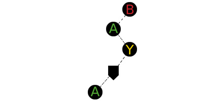
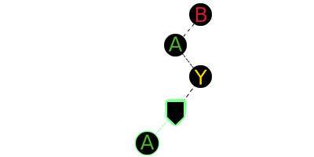
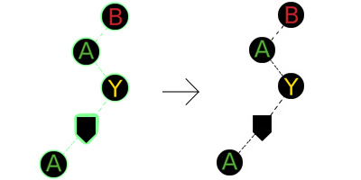

I am [Guillermo García Subirana](https://www.linkedin.com/in/guillermo-garc%C3%ADa-subirana-36a783b5/), student of the
[Bachelor’s Degree in
Video Games by UPC at CITM](https://www.citm.upc.edu/ing/estudis/graus-videojocs/). This content is generated for the second year’s
subject Project 2, under supervision of lecturer
[Ricard Pillosu](https://es.linkedin.com/in/ricardpillosu).

## **Intro to the problem** 

An input combo system can vary greatly from one video game to another. That's why we have not established a fixed system to follow when we're developing a system for our video game.
In this guide we will investigate about the input combos system that some video games have developed, we will discuss the different techniques that can be applied and, finally, we will make step by step our input system combo.
My intention is to make the system as flexible and complete as possible, which can be adapted to any project with a few simple changes. All the development exposed on this page has been done from scratch with techniques developed from the research done before this guide.

## Different approaches by different games

First let's analyze some games that use a input combo system significantly different between them. In this way we can distinguish some key parts of the system more easily.

### Street Fighter

_Street Fighter - Ryu vs Ken_

In Street Fighter, the user is able to perform a variety of combos already defined. Some keys of their input combo system are:

* To make a combo it is not enough to press a defined series of keys correctly, it must be in correct timing and in a limited time.
* The pool of possible inputs is not excessively long.

### Heavy Rain

_Heavy Rain example_

In Heavy Rain they usually use a very interesting input combo system:
* The system stores the events entered by the user and allows you to continue the combo (showing in this case) the new event key to follow.
* The system constantly checks that you are keeping the keys already pressed without taking into account how long it takes to press the next one.

## Description in detail

In all the titles that use an input combo system, they use a vector/list or tree (difference explained in detail below) to store the last inputs introduced by the user.

### Input Storage

* Vector/List:

If we use a vector or list to store the inputs generated by the user, we will have to require a list of combos already defined to compare in each iteration of the application if there is a match between the "volatile" inputs that have been entered and the combo already defined.

The images below shows a combo list already predefined (the one above) that will be compared with the volatile vector (the bottom one) to know if the combo has been successfully completed at some time.

_Volatile vector doesn't match with the predefined combo_

_Introced new input in the volatile vector_

_There is a match between volatile chain and the predefined combo_

_The volatile combo is cleaned_

* Tree

On the other hand we can use a tree to store both the last inputs entered by the user and the combo itself.
In this way, every time an input is received we will have to check if we can continue the path towards the end of the combo. In case of not being able to continue with the given input, the combo will fail and will have to start from the beginning.
Also keep in mind that the combos system will only be aware of the input that follows.

_The tree is build around the combo/s predefined and wait for only the required input_

_The tree has obtained a new event and stores it temporarily (green mark)_

_If the tree gets an incorrect input (red mark), the previously stored events are deleted_

_If the end of the tree is reached, the combo will be made and the temporary events will be cleaned_

### Buffer circular

As we already know the memory is not unlimited and, therefore, storage is usually carried out using a circular buffer system that keeps the most recent inputs in memory.
In this way, every time a new input is introduced (and therefore the oldest one is deleted) it is checked from the first found event to the last one created and then look for a match between the chain of inputs and one of our combos.
It should be noted that conditions can be added to eliminate events such as in a fighting game: the time between events.

In the images below, the time buffer is shown graphically. The blue line marks the time (milliseconds) that must happen for the last input to be deleted. For another band the red mark indicates the time limit that has the following input to be considered as a combo with the previous ones.

_The volatile chain with three inputs_

_The condition of time has caused input "A" to be eliminated. While another input "B" has entered_

### Resolution of the combo

In case of finding a match, we will eliminate or not the list of our last events and the appropriate movement or action can be carried out by means of a finite state machine.

## Our approach step by step

Since in a fight / beat em 'up genre the input combo system becomes more complex due to the time factor between events, we are going to create a combo system similar to the one that a videogame of this genre would use, although it will be ready to adapt to any other combo system in an easy way.

First let's locate, all the magic of this system will occur in the folder _InputComboSystem_. In this folder we'll find three classes:

* **Combo**: In this class we will define and load all the necessary inputs to form a combo. From this class we will also check if a combo has been solved or not.

* **Input Event**: This class will define the type of input (a direction?, an action?). In addition, each input event will have a timer that will allow us to know when the input entered, the time it has taken between that input and the next and finally, the limit that had from one input to another (used in the inputs of the combo).

* **ctInput Combo**: The core of the system. From this class we will collect the inputs, and we will use the two previous classes so that everything works.

### TODO 1

RESOLVED TODO 1: mimimi

Optional Homework for practicing!

## Performance and ways to improve

ms that is going all the module

* App.inputcombo

* Callbacks

## References

references about the project

## License

~~~~~~~~~~~~~~~

MIT License

Copyright (c) 2018

Permission is hereby granted, free of charge, to any person obtaining a copy
of this software and associated documentation files (the "Software"), to deal
in the Software without restriction, including without limitation the rights
to use, copy, modify, merge, publish, distribute, sublicense, and/or sell
copies of the Software, and to permit persons to whom the Software is
furnished to do so, subject to the following conditions:

The above copyright notice and this permission notice shall be included in all
copies or substantial portions of the Software.

THE SOFTWARE IS PROVIDED "AS IS", WITHOUT WARRANTY OF ANY KIND, EXPRESS OR
IMPLIED, INCLUDING BUT NOT LIMITED TO THE WARRANTIES OF MERCHANTABILITY,
FITNESS FOR A PARTICULAR PURPOSE AND NONINFRINGEMENT. IN NO EVENT SHALL THE
AUTHORS OR COPYRIGHT HOLDERS BE LIABLE FOR ANY CLAIM, DAMAGES OR OTHER
LIABILITY, WHETHER IN AN ACTION OF CONTRACT, TORT OR OTHERWISE, ARISING FROM,
OUT OF OR IN CONNECTION WITH THE SOFTWARE OR THE USE OR OTHER DEALINGS IN THE
SOFTWARE.

~~~~~~~~~~~~~~~
